# Project: DADS5001

[https://www.nodi.so/widgets/embed/b270bdd0-e65c-41af-8a50-be0eb69e2e4a](https://www.nodi.so/widgets/embed/b270bdd0-e65c-41af-8a50-be0eb69e2e4a)

### Dataset/ Data source

- Data Traffy x Bangkok. ข้อมูลแจ้งความเสียหายจากแผ่นดินไหว  [https://dcd2dbdb64ee.ngrok-free.app/earthquake](https://dcd2dbdb64ee.ngrok-free.app/earthquake)
- Dataset historical earthquake data ย้อนหลัง 20 ปี ([NCEI Hazard Earthquake Search](https://www.ngdc.noaa.gov/hazel/view/hazards/earthquake/search)), ([raw.githubusercontent.com/tontantip/Archive/refs/heads/main/earthquakes-2025-08-30_18-19-15_%2B0700.tsv](https://raw.githubusercontent.com/tontantip/Archive/refs/heads/main/earthquakes-2025-08-30_18-19-15_%2B0700.tsv))
- ข้อมูลสถิติจำนวนประชากรไทย ****[https://stat.bora.dopa.go.th/new_stat/webPage/statByAgeMonth.php](https://stat.bora.dopa.go.th/new_stat/webPage/statByAgeMonth.php)
- ข้อมูลพื้นที่ ผังสี
- ข้อมูลชั้นดิน

### Problem Framing (คำถาม)

1. เขตไหนในกรุงเทพมีเกิดความเสียหายจากแผ่นดินไหวได้มากที่สุด  (ไม่เกิน Top 5)

แบ่งตามคะแนนความเสียหาย

1. พิจารณาจาก Data  Traffy x Bangkok: ข้อมูลความเสียหาจากแผ่นดินไหว
2. ข้อมูลชั้นดิน
3. ผังสี
4. building type 

** ที่ตั้ง โรงพยาบาล

1. พื้นที่ปลอดภัยในแต่ละเขต
    1. พิจารณาจาก Data  Traffy x Bangkok: ข้อมูลความเสียหายจากแผ่นดินไหว
    2. ข้อมูลพื้นที่ ผังสี (เขตและผังเมือง)
    3. ข้อมูลชั้นดิน
    4. พื้นที่โล่ง 
2. มาตราการรับมือตามความเสี่ยงของพื้นที่ที่ได้รับผลกระทบจากแผ่นดินไหว

** เพิ่มมูลค่าของที่ดิน หรือจุดยุทธศาตร์

1. ข้อมูลพื้นที่(เขตและผังเมือง)
2. ข้อมูลชั้นดิน
3. ข้อมูลอาคาร (Building type)
4. ข้อมูลประชากรแต่ละเขต อายุ 

### Code (Link colab)

[Google Colab](https://colab.research.google.com/drive/1unbPIjW9EGLOjdhaeeRb-4hEfiXcDfBX?usp=sharing)

```python
## import requests and pprint
import requests
from pprint import pprint
## set url API
url = "https://data.tmd.go.th/api/DailySeismicEvent/v1/?uid=api&ukey=api12345&format=json"
data = requests.get(url)
if data.status_code == 200:
    daily = data.json()
    result = daily['DailyEarthquakes']
    print("request API OK")
else:
    print("API ERROR")

import pandas as pd
df = pd.json_normalize(result)
df.info()
```

## Presentation

😁 เราจะ presentation ผ่าน GitHub>> 

[https://github.com/tontantip/DADS5001-Project-Earthquake-.git](https://github.com/tontantip/DADS5001-Project-Earthquake-.git)

---

### Object

- วิเคราะห์เชิงลึกเกี่ยวกับข้อมูลการแจ้งความเสียหายจากเหตุการณ์แผ่นดินไหวในประเทศไทย
- ศึกษาเพื่อหาพื้นที่ปลอดภัยเพื่อการอพยพเมื่อเกิดแผ่นดินไหว(Safe zone) ภายในพื้นที่จังหวัดกรุงเทพมหานคร
- วิเคราะห์โครงสร้างอาคาร หรือสิ่งปลูกสร้างต่างๆกับผลกระทบจากแผ่นดินไหว

### Start 0. Introduction

ตั้งแต่ปี ค.ศ. 2005 ถึง เดือน สิงหาคม 2025 จากการรวมรวบสถิติเกิดแผ่นดินไหวทั่วโลก พบว่าจำนวนครั้งการเกิดแผ่นดินไหวแต่ละปีมีจำนวนครั้งไม่ต่ำกว่า 20 ครั้งในทุกขนาดความรุนแรงที่ปลดปล่อยออกมา หากพิจารณาเพียงจำนวนครั้งการเกิดแผ่นดินไหวไม่สามารถสรุปแนวโน้มแน่นอนได้ว่าเพิ่มขึ้นหรือลดลง แสดงให้เห็นว่าปัจจัยมีความซับซ้อนและหลากหลาย

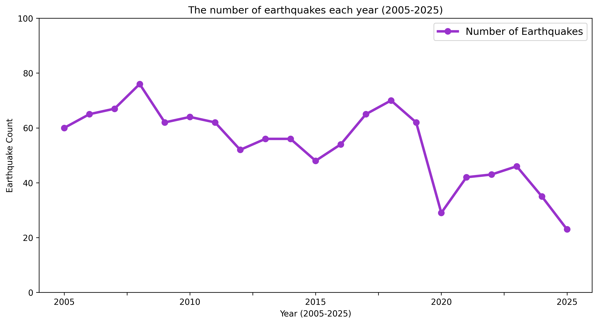

Figure 1: Bar Chart แสดงจำนวนการเกิดแผนดินไหว (แกน Y: จำนวนครั้งเหตุการณ์แผ่นดินไหว) แต่ละปี ตั้งแต่ 2005-2025(เดือน สิงหาคม) (แกน X: ปี (2005-2025)) ในแต่ละปีมีจำนวนแผ่นดินไหวไม่ต่ำกว่า 20 ครั้ง และไม่มีแนวโน้มที่แน่นอน

[https://github.com/tontantip/DADS5001-Project-Earthquake/blob/main/image/Number of earthquakes 2005-2025.png?raw=true](https://github.com/tontantip/DADS5001-Project-Earthquake/blob/main/image/Number%20of%20earthquakes%202005-2025.png?raw=true)

#หากวิเคราะห์การกระจายคาวมรุนแผ่นดินไหวโดยตรง (มาตราวัดขนาด: Magnitude) หรือที่ทราบกันดีในหน่วย ริกเตอร์ สเกล (Richter scale) ตั้งแต่ปี 2005-2025 (Figure2) พบว่าการกระจายขนาดความรุนแรงส่วนใหญ่ (Median) จะอยู่ในช่วง 5.5 ถึง 6.5 ถึงเป็นความรุนแรงสามารถทำให้เกิดความเสียหายบริเวณที่เป็นศูนย์กลางของการเกิดแผ่นดินไหวได้ ในปี 2011 มีค่า Outlier ความรุนแรงสูงมากเมื่อเทียบกับปีอื่นๆ ซึ่งมีขนาดถึง 9.0 ริกเตอร์ ซึ่งเป็นเหตุการณ์แผ่นไหวขนาด 9.0 ริกเตอร์ที่โทโฮคุ ประเทศญี่ปุ่น

.png)

Figure 2: Boxplot แสดงการกระจายของความรุนแรงแผ่นดินไหว (แกน Y: Magnitude) ในแต่ละปี (แกน X: ปี 2005-2025)

[https://github.com/tontantip/DADS5001-Project-Earthquake/blob/main/image/Distribution of Earthquake Magnitudes per Year (2005-2025).png?raw=true](https://github.com/tontantip/DADS5001-Project-Earthquake/blob/main/image/Distribution%20of%20Earthquake%20Magnitudes%20per%20Year%20(2005-2025).png?raw=true)

#แก้หน่วยปีในกราฟ ไม่มี.0

จากกราฟทั้ง 2 (Figure1 และ Figure2) ระหว่างจำนวนการเกิดแผ่นดินไหวและการกระจายตัวความรุนแรงของแผ่นดินไหว พบในปีที่มีจำนวนครั้งเกิดแผ่นดินไหวบ่อยจะมีความรุนแรงที่ไม่สูง เช่นในปี 2008 (76 ครั้ง) แต่ค่า Median และค่า Outlier ความรุนแรงในปีดังกล่าวไม่สูงมาก  สอดคล้องกับกฎของ Gutenberg-Richter ซึ่งระบุว่า เมื่อขนาดความรุนแรงของแผ่นดินไหวเพิ่มขึ้น จำนวนครั้งที่เกิดขึ้นจะลดลงอย่างเป็นทวีคูณ (exponentially)

ปัญหาใหญ่ที่มาพร้อมกับการเกิดแผ่นไหวคือ ความสูญเสียไม่ว่าจะเป็นด้านชีวิต และ มูลค่า(จำนวนเงิน) โดยตั้งแต่ปี 2005 - 2025 ประเทศที่มีอัตราความเสียหายต่อจำนวนครั้งที่เกิดแผ่นดินไหวมากที่สุด 863.72 ล้านดอลล่า คือ ประเทศญี่ปุ่นมีจำนวนการเกิดแผ่นดินไหว 61 ครั้ง จาก Figure 3 ในขณะที่ประเทศจีนมีจำนวนครั้งการเกิดแผ่นดินไหว 124 มากที่สุด แต่มีอัตราความเสียหายต่อจำนวนครั้ง 863.71 ล้านดอลล่า เป็นอันดับที่ 9 ของโลก ค่อยต่ำเมื่อเทียบกับจำนวนครั้งที่เกิดเหตุการณ์ อีกหนึ่งปัจจัยที่สำคัญและเป็นปัจจัยทางภูมิศาตร์คือ พื้นที่ของแต่ละประเทศ ประเทศจีนมีพื้นที่ 9.7 ล้านตารางกิโลเมตร มีพื้นที่มากเป็นอันดับ 1 ของโลก ส่วนประเทศญี่ปุ่นมีพื้นที่ 377,930 ตารางกิโลเมตร มีพื้นที่เป็นอันดับที่ 61 ของโลก ข้อมูลนี้แสดงให้เห็นว่าพื้นที่ของประเทศและความหนาแน่นของประชากรแม้มีจำนวนเหตุการณ์เกิดแผ่นดินไหวไม่มากก็สามารถมีอัตราความเสียหายต่อจำนวนเหตุการณ์ที่สูงได้ (จากเคสของประเทศญี่ปุ่น) 

ถ้าพิจารณาอัตราความเสียหายต่อพื้นที่ของแต่ละประเทศ Figure 4 สูงที่สุดคือประเทศญี่ปุ่น 784,240 ดอลล่าต่อตารางกิโลเมตร ที่เป็นประเทศที่เกิดเหตุการณ์บ่อย และอันดับของ 2 คือประเทศเฮติที่มีอัตราความเสียหาย 348,650 ดอลล่าต่อตารางกิโลเมตร เนื่องจากประเทศเฮติมีพื้นที่ประเทศ 27,750 ตารางกิโลเมตร (อันดับที่ 146 ของโลก) จัดเป็นประเทศที่มีขนาดเล็ก ดังนั้นปัจจัยที่มีผลต่ออัตราความเสีย ได้แก่ จำนวนเหตุการณ์เกิดแผ่นดินไหว, พื้นที่ของประเทศ และ ความหนาแน่นของประชากร เป็นต้น 

.png)

Figure 5: กราฟแสดงข้อมูล Total Damage per Event Top 15 (อัตราความเสียหายต่อเหตุการณ์) และ Number of Events (จำนวนเหตุการณ์) ของประเทศ 15 อันดับแรก แกนY(ซ้าย) Damage per Event อัตราความเสียหายต่อเหตุการณ์ ($Mil/event) แกนY(ขวา)  Number of Event จำนวนเกิดเหตุการณ์แผ่นดินไหว แกนX Country ชื่อประเทศ

[https://github.com/tontantip/DADS5001-Project-Earthquake/blob/main/image/Total Damage per Event and Number of Event by Country (Top 15)1.png?raw=true](https://github.com/tontantip/DADS5001-Project-Earthquake/blob/main/image/Total%20Damage%20per%20Event%20and%20Number%20of%20Event%20by%20Country%20(Top%2015)1.png?raw=true)

1.png)

Figure 6: กราฟแสดงข้อมูล Total Damage per Area by Country (อัตราความเสียหายรวมต่อพื้นที่) แกนX Damage per Area อัตราความเสียหายต่อพื้นที่ ($k/square meter) แกนX Country ชื่อประเทศ

[https://github.com/tontantip/DADS5001-Project-Earthquake/blob/main/image/Total Damage per Area by Country (Top 20)1.png?raw=true](https://github.com/tontantip/DADS5001-Project-Earthquake/blob/main/image/Total%20Damage%20per%20Area%20by%20Country%20(Top%2020)1.png?raw=true)

มูลค่าความเสียหายเป็นจำนวนเงินสูงที่ประเทศต่อแบกรับ สำหรับประเทศไทยมีอัตราความเสียหายต่อเหตุการณ์เกิดแผ่นดินไหว 393.12 ล้านดอลล่า อันดับที่ 12 ของโลก และอัตราความเสียหายต่อพื้นที่ตารางกิโลเมตร 3,830 ดอลล่าต่อตารางกิโลเมตร อันดับที่ 17 ของโลก นับเป็นจำนวนเงินที่สูงมากที่ต้องสูญเสียไปกับการเกิดเหตุการณ์แผ่นดินไหว ทำให้ประเทศสูญเสียงบประมาณและเสียโอกาสในการพัฒนาประเทศไทย ดังนั้นการบริหารความเสี่ยง เช่น เมื่อเกิดเหตุแผ่นดินไหวพื้นที่ไหนมีความเสียหายมาก, สิ่งปลูกสร้างประเภทไหนที่เสี่ยงจะเสียหาย พิจารณาร่วมกับปัจจัยต่างๆเพื่อบริหารความเสี่ยง สามารถลดอัตราความสูญเสียในอนาคตได้

ในวันที่ 28 มีนาคม พ.ศ.2568 เกิดเหตุแผ่นดินไหวศูนย์กลางอยู่ในภาคซะไกง์ของประเทศพม่า แรงสั่นสะเทือนส่งผลกระทบถึงประเทศไทยมีอาคาร ที่อยู่อาศัย ได้รับความเสียหายจำนวนมาก 

แผ่นดินไหวเป็นภัยที่ไม่สามารถทราบล่วงหน้าว่าจะเกิดขึ้นที่ไหนและเมื่อไรได้อย่างแน่นอน เนื่องจากสาเหตุที่เกิดการจากเคลื่อนตัวของแผ่นเปลือกโลกจากการสะสมของพลังงานเกิดแบบไม่สม่ำเสมอ ปัจจุบันสามารถทำได้เพียงคาดการณ์จากปัจจัยต่างที่มีแนวโน้มทำให้เกิดแผ่นดินไหวขึ้นเพียงเท่านั้น ดังนั้นการประเมินความเสี่ยงและเตรียมความพร้อมเพื่อลดความเสียหายจากภัยพิบัตินี้ได้ดีขึ้นมาก

](https://thestandard.co/wp-content/uploads/2025/05/SAO-Collapse.jpg?x62638)

*Figure1: อาคารสำนักการตรวจเงินแผ่นดินถล่ม. 
ที่มา* [https://thestandard.co/](https://thestandard.co/)

### Data analytics ไม่ใช้

การวิเคราะห์ความเปราะบางของสิ่งปลูกสร้าง 

วิเคราะห์จากข้อมูลแจ้งความเสียหายพบว่าโครงสร้างของคอนโดมิเนียม (5,865 ครั้ง) มีจำนวนการแจ้งความเสียหายเข้ามามากที่สุดเป็นอันดับหนึ่งไม่ว่าจะแบ่งตามลักษณะดิน หรือพื้นที่ใช้ประโยชน์ของกรุงเทพมหานคร ตามมาด้วย บ้าน (2,432 ครั้ง) เป็นอันดับ 2 คิดเป็น 70% ของจำนวนการแจ้งความเสียหายทั้งหมด (จำนวนแจ้งจาก คอนโดมิเนียมกับบ้าน) และในขณะเดียวกันจำนวนจากคอนโดมิเนียม มากกว่าขึ้น 2 เท่าของอันดับ 2 อย่างบ้าน (Figure )

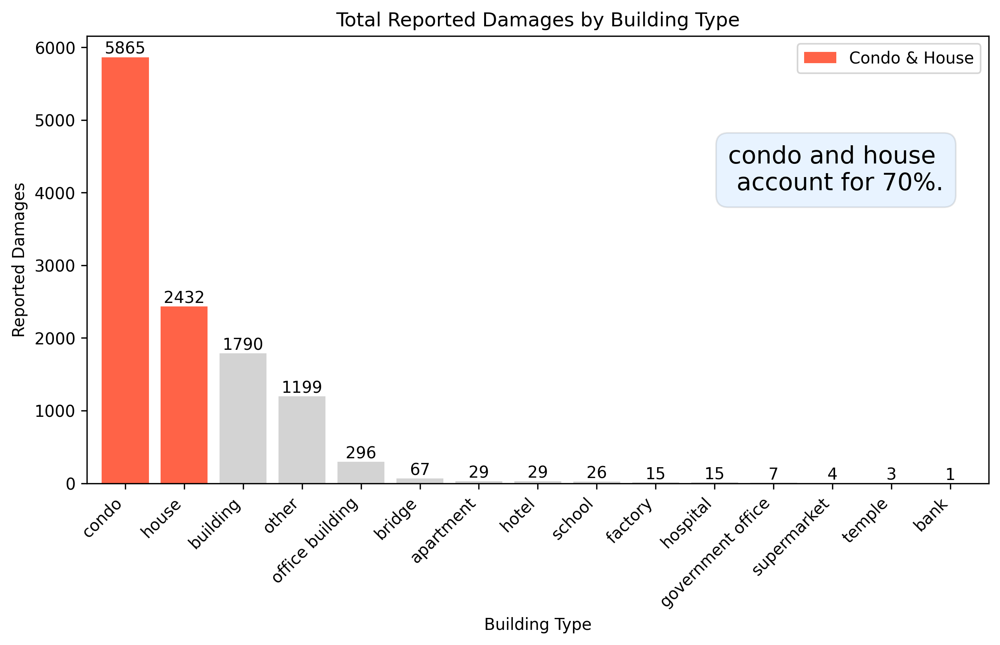

สิ่งที่น่าสนใจคือ จำนวนที่มีการแจ้งความเสียหายหลังจากการตรวจสอบแล้วไม่พบความเสียหาย คอนโดมิเนียมมีมากที่สุดจำนวน 726 ครั้ง คิดเป็น 6.17% ของจำนวนแจ้งทั้งหมด(Figure ) ดังนั้นปัจจัยที่ทำให้จำนวนการแจ้งจากคอนโดมิเนียมสูงมาก อาจจะมีดังนี้

- จำนวนยูนิตที่มากกว่า คอนโดมิเนียมหนึ่งหลังมีจำนวนยูนิต (ห้องชุด) มากกว่าบ้านเดี่ยวหนึ่งหลังหลายสิบหรือหลายร้อยเท่า การแจ้งความเสียหายอาจมาจากหลายยูนิตในอาคารเดียวกัน
- ลักษณะโครงสร้าง เนื่องจากคอนโดมิเนียมมีโครงสร้างที่ซับซ้อนมากกว่าสิ่งปลูกสร้างอื่นๆ เช่น ความสูง, โครงสร้างบางอย่างจำเป็นต้องใช้ร่วมกัน รวมกับปัจจัยแรกอาจทำให้จำนวนการแจ้งของคอนโดมิเนียมสูงที่สุด

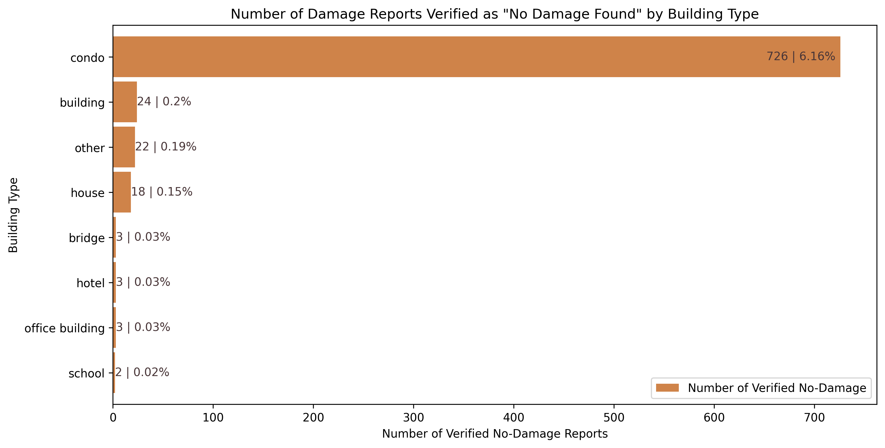

เจาะลึกด้านโครงสร้างประเภทของความเสียหายพบว่า ความเสียหายที่กำแพงมีจำนวนมากที่สุด 2,640 ครั้ง ความเสียหายที่เสาจำนวน 1,806 ครั้ง ความเสียหายที่โครงสร้าง 1,500 ครั้ง ความเสียหายที่พื้นจำนวน 1,124 ครั้ง และความเสียหายที่เพดาน 1,060 ครั้ง สามารถตีความได้เบื้องต้นว่าส่วนใหญ่เกิดความเสียหายที่กำแพง แสดงว่าความเสียหายส่วนใหญ่ไม่เกี่ยวกับโครงสร้างหลักที่สำคัญต่อการรับน้ำหนักของอาคารโดยตรง เช่น เสา คาน หรือพื้น

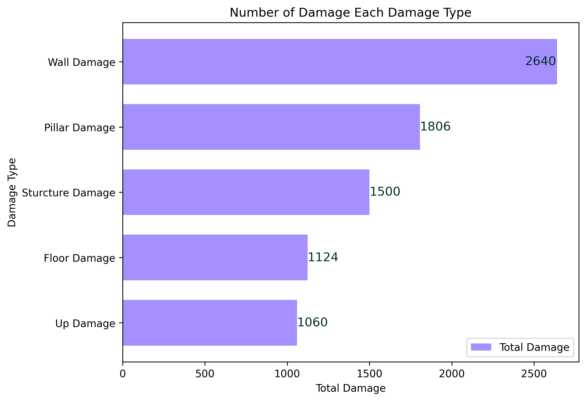

วิเคราะห์ความเสียหายของโครงสร้างอาคารโดยแบ่งตามลักษณะที่ตั้ง

วิเคราะห์เจาะลึกเกี่ยวกับพื้นที่ตั้งของจุดที่มีการแจ้งปัญหาโดยแบ่งตามพื้นที่ใช้ประโยชน์ตามสีผังเมืองของกรุงเทพมหานคร และ ลักษณะชั้นดิน

พบว่า ชั้นดิน zoning A ดินอ่อนพอสมควร มีการแจ้งมากที่สุดถึง 9,890 ครั้ง คิดเป็น 84% ของจำนวนการแจ้งทั้งหมด ชั้นดิน zoning B ดินอ่อนมากมีการแจ้ง 1,886 ครั้ง และ zoning C ดินอ่อนที่สุดมีการแจ้ง 2 ครั้ง 

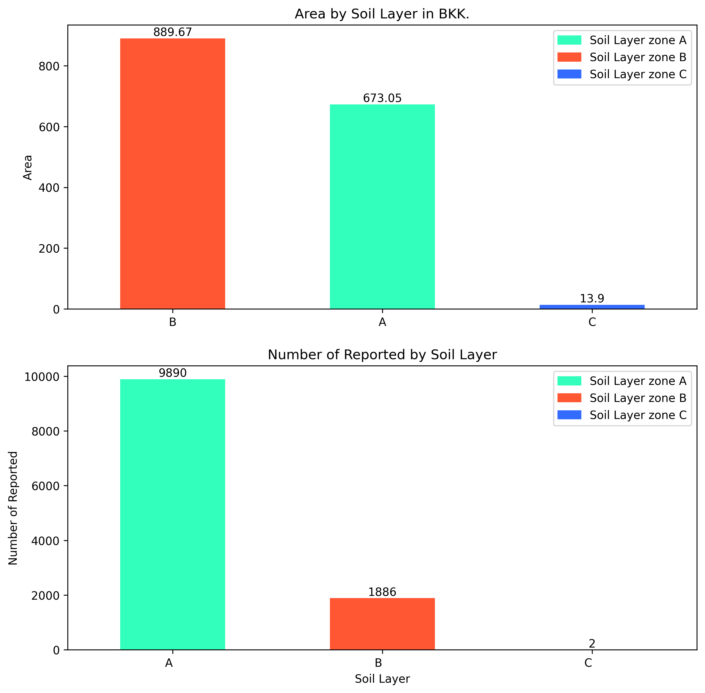

ข้อมูลจากเว็บไซต์([https://tmd.go.th](https://tmd.go.th/info/%E0%B9%81%E0%B8%9C%E0%B8%99%E0%B8%94%E0%B8%99%E0%B9%84%E0%B8%AB%E0%B8%A7)) ระบุว่าลักษณะชั้นดินที่เป็นดินอ่อนมักจะขยายแรงสั่นสะเทือนได้ดี หรือความอ่อนของชั้นดินมากโอกาสเสี่ยงที่จะเกิดความเสียหายมาก หมายความว่า ตามทฤษฎีแล้ว ชั้นดินใน zone C มีความเสี่ยงเกิดความเสียหายมากที่สุด ตามด้วย zone B และ A ตามลำดับ ซึ่งขัดแย้งกับข้อมูลเป็นจริง แต่ถ้าพิจารณาพื้นที่ของแต่ละลักษณะชั้นดินในพื้นที่กรุงเทพมหานคร พบว่าในกรุงเทพมหานครมีพื้นที่ชั้นดิน zone B มากที่สุด 889,672,540 ตารางเมตร (56%) พื้นที่ zone A 673,050,384 ตารางเมตร (43%) พื้นที่ zone C น้อยที่สุด 13,896,907 (1%) เท่านั้น สามารถตีความได้ว่า

- จำนวนการแจ้งความเสียหายมาจากพื้นที่ของ zone A และ B เป็นส่วนใหญ่เนื่องจากพื้นที่ส่วนใหญ่ของกรุงเทพมหานครเป็นลักษณะชั้นดินแบบ zone A และ B ทำให้มีประชากรแลสิ่งปลูกสร้างที่หนาแน่นกว่า มีโอกาสที่จะมีการแจ้งความเสียหายมากกว่า
- เนื่องจากพื้นที่ชั้นดิน zone C จะเป็นต้องใช้เทคนิคก่อสร้างที่ซับซ้อนและมีราคาแพงกว่า เพื่อรองรับชั้นดินที่อ่อนและมีโอกาสทรุดตัว
- กฎหมายผังเมือง เมื่อปีพ.ศ. 2556 กรุงเทพมหานคร ได้แบ่งพื้นที่ใช้ประโยชน์ตามสีผังเมือง จากการวิเคราะห์พบว่า พื้นสำหรับที่อยู่อาศัยและพาณิชยกรรม และมีการแจ้งความเสียหายสูงถึง 94% อยู่ในพื้นที่ชั้นดิน zone A และ B

#Poon แปะๆไปก่อนนะ

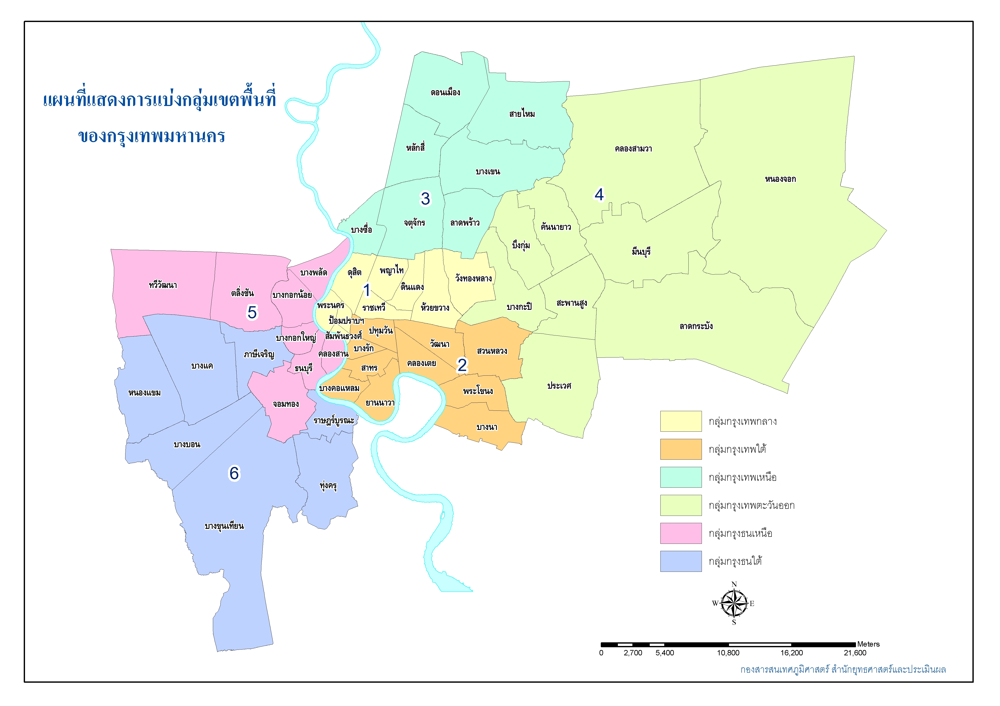

[แผนที่เขตการปกครอง – BMA GIS](https://district.bangkok.go.th/SEDPortal/map1/)


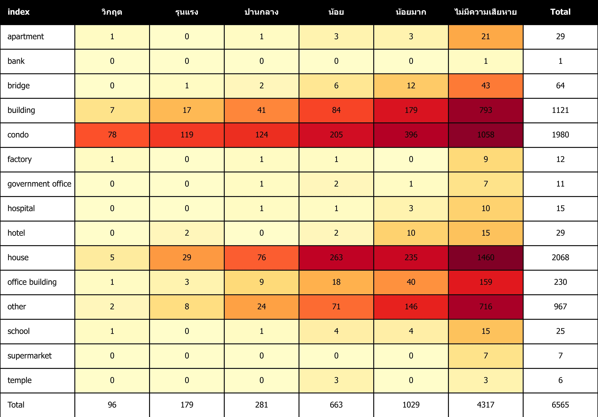


---

---

#หา insight ชั้นดินไม่เจอเลย อาจจะเอามาพูดไม่ได้ ไม่มีอะไรให้พูดเลย


---

# เรียง story telling

## 1.ภาพรวมข้อมูลก่อน

---

จากข้อมูลการแจ้งเหตุแผ่นดินไหวในพื้นที่กรุงเทพมหานครทั้ง 50 เขต จำนวน **11,789 รายการ** ได้มีการนำข้อมูลที่ได้รับมาจับคู่กับพิกัดทางภูมิศาสตร์เพื่อระบุความเกี่ยวข้องกับสิ่งปลูกสร้างต่างๆ พบว่ามีข้อมูลที่เชื่อมโยงกับสิ่งปลูกสร้างรวมทั้งสิ้น **6,565 แห่ง** จากการตรวจสอบเพิ่มเติม พบว่าร้อยละ 53 ของการแจ้งเหตุ (6,245 คำร้อง) ระบุถึงความเสียหาย ขณะที่เมื่อพิจารณาจากจำนวนสิ่งปลูกสร้างทั้งหมด พบว่ามี **สิ่งปลูกสร้างที่ได้รับความเสียหายจำนวน 2,248 แห่ง** หรือคิดเป็นร้อยละ 34 ของจำนวนสิ่งปลูกสร้างทั้งหมด ส่วนสิ่งปลูกสร้างที่เหลือ **4,317 แห่ง** (66% ของทั้งหมด) **ไม่พบความเสียหาย** จากเหตุการณ์ดังกล่าว


> กราฟแสดงสัดส่วนของการแจ้งเหตุแผ่นดินไหวทั้งหมดจำนวน 11,789 รายการ พบว่ามี 52.93% ของคำร้องทั้งหมดที่แจ้งว่าได้รับความเสียหาย (6,245 รายการ) ส่วนที่เหลือ 47.07% (5,544 รายการ) ไม่ได้มีการแจ้งความเสียหาย
> 

[https://github.com/tontantip/DADS5001-Project-Earthquake/blob/main/image/สัดส่วนของการแจ้งเหตุแผ่นดินไหว.png](https://github.com/tontantip/DADS5001-Project-Earthquake/blob/main/image/%E0%B8%AA%E0%B8%B1%E0%B8%94%E0%B8%AA%E0%B9%88%E0%B8%A7%E0%B8%99%E0%B8%82%E0%B8%AD%E0%B8%87%E0%B8%81%E0%B8%B2%E0%B8%A3%E0%B9%81%E0%B8%88%E0%B9%89%E0%B8%87%E0%B9%80%E0%B8%AB%E0%B8%95%E0%B8%B8%E0%B9%81%E0%B8%9C%E0%B9%88%E0%B8%99%E0%B8%94%E0%B8%B4%E0%B8%99%E0%B9%84%E0%B8%AB%E0%B8%A7.png)


> กราฟแสดงสัดส่วนของ **สิ่งปลูกสร้างทั้งหมด** จำนวน **6,565 แห่ง** พบว่ามี **34.24%** ของสิ่งปลูกสร้างที่ได้รับความเสียหาย (2,248 แห่ง) ส่วนที่เหลือ **65.76%** (4,317 แห่ง) ไม่ได้มีการแจ้งความเสียหาย
> 

[https://github.com/tontantip/DADS5001-Project-Earthquake/blob/main/image/สัดส่วนของสิ่งปลูกสร้างทั้งหมด.png](https://github.com/tontantip/DADS5001-Project-Earthquake/blob/main/image/%E0%B8%AA%E0%B8%B1%E0%B8%94%E0%B8%AA%E0%B9%88%E0%B8%A7%E0%B8%99%E0%B8%82%E0%B8%AD%E0%B8%87%E0%B8%AA%E0%B8%B4%E0%B9%88%E0%B8%87%E0%B8%9B%E0%B8%A5%E0%B8%B9%E0%B8%81%E0%B8%AA%E0%B8%A3%E0%B9%89%E0%B8%B2%E0%B8%87%E0%B8%97%E0%B8%B1%E0%B9%89%E0%B8%87%E0%B8%AB%E0%B8%A1%E0%B8%94.png)

#แก้กราฟด้านบนขวา


Figure 7: กราฟการวิเคราะห์ความเสียหายเชิงโครงสร้าง (Analysis of Structural Damage) ประกอบด้วย จำนวนแจ้งความเสียหายแบ่งตามประเภทสิ่งปลูกสร้าง (Total Reported Damages by Building Type), จำนวนแจ้งความเสียหายแล้วไม่พบความเสียหายแบ่งตามประเภทสิ่งปลูกสร้าง (Number of Damage Reports Verified as "NO Damage Found" by Building Type),  จำนวนเสียหายแบ่งตามประเภทความเสียหาย (Number of Damage Each Damage Type)

[https://github.com/tontantip/DADS5001-Project-Earthquake/blob/main/image/Analysis of Structural Damage1.png?raw=true](https://github.com/tontantip/DADS5001-Project-Earthquake/blob/main/image/Analysis%20of%20Structural%20Damage1.png?raw=true)

วิเคราะห์ความเสียหายเชิงโครงสร้างที่จากข้อมูลการแจ้งเหตุแผ่นดินไหวในกรุงเทพมหานคร Figure พบว่าสัดส่วนจำนวนการแจ้งเหตุระบุสิ่งปลูกสร้างเป็น คอนโดมิเนียม (5,865 ครั้ง) สูงที่สุดและมากกว่า บ้าน (2,432 ครั้ง) ถึง 2 เท่า รวมกันมีสัดส่วนสูงถึง 70%  หลังจากการตรวจสอบความเสียหายจากสถานที่แจ้งเหตุมาพบว่า คอนโดมิเนียน มีจำนวนเหตุการณ์ไม่พบความเสียหายตามที่แจ้งสูงที่สุดคือ 726 ครั้ง (6.16%) ของจำนวนเหตุการณ์ที่แจ้งความเสียหายทั้งหมด ปัจจัยสำคัญที่ทำให้มีจำนวนการแจ้งเหตุความเสียสูงที่สุด อาจมีดังนี้

- จำนวนยูนิตที่มากกว่า คอนโดมิเนียมหนึ่งหลังมีจำนวนยูนิต (ห้องชุด) มากกว่าบ้านเดี่ยวหนึ่งหลังหลายสิบหรือหลายร้อยเท่า การแจ้งความเสียหายอาจมาจากหลายยูนิตในอาคารเดียวกัน
- ลักษณะโครงสร้าง เนื่องจากคอนโดมิเนียมมีโครงสร้างที่ซับซ้อนมากกว่าสิ่งปลูกสร้างอื่นๆ เช่น ความสูง, โครงสร้างบางอย่างจำเป็นต้องใช้ร่วมกัน รวมกับปัจจัยแรกอาจทำให้จำนวนการแจ้งของคอนโดมิเนียมสูงที่สุด

และต่อมาประเภทความเสียหายที่เกิดขึ้น พบว่า ความเสียหายที่กำแพง (Wall Damage) มีจำนวนมากที่สุด 2,640 ครั้ง ทำให้สามารถตีความได้เบื้องต้นว่าส่วนใหญ่เกิดความเสียหายที่กำแพง แสดงว่าความเสียหายส่วนใหญ่ไม่เกี่ยวกับโครงสร้างหลักที่สำคัญต่อการรับน้ำหนักของอาคารโดยตรง เช่น เสา คาน หรือพื้น สิ่งปลูกสร้างส่วนในกรุงเทพมหานครมีความแข็งแรงทางโครงสร้างรับน้ำหนักได้ดีพอสมควร

.png)

Figure : กราฟการวิเคราะห์ความเสียหายเชิงพื้นที่ (Analysis of Location) ประกอบด้วย พื้นที่ประเภทชั้นดินในกรุงเทพมหานคร (Area by soil layer in BKK) หน่วย ล้านตารางเมตร, จำนวนเหตุแบ่งตามประเภทของชั้นดิน (Number of Reported by Soil Layer), จำนวนเหตุแบ่งตามพื้นที่ใช้ประโยชน์ของกรุงเทพมหานครและประเภทชั้นดิน (Total Reported Damage by Land use zone and soil layer)


Figure : ตารางที่อธิบายคุณสมบัติของชั้นดิน (Soil Layer) ในเขตกรุงเทพมหานคร โดยแบ่งออกเป็น 3 ประเภทหลัก ได้แก่ **โซน A, โซน B, และโซน C**

#แก้ชื่อผังสี เป็นภาษาไทย ชื่อตามกราฟพี่แตง

วิเคราะห์เจาะลึกเกี่ยวกับพื้นที่ตั้งของจุดที่มีการแจ้งปัญหาโดยแบ่งตามพื้นที่ใช้ประโยชน์ตามสีผังเมืองของกรุงเทพมหานคร และ ลักษณะชั้นดินพบว่า ชั้นดิน zoning A ดินอ่อนพอสมควร มีการแจ้งมากที่สุดถึง 9,890 ครั้ง คิดเป็น 84% ของจำนวนการแจ้งทั้งหมด ชั้นดิน zoning B ดินอ่อนมากมีการแจ้ง 1,886 ครั้ง และ zoning C ดินอ่อนที่สุดมีการแจ้ง 2 ครั้ง 

ข้อมูลจากกรมอุตุนิยมวิทยา([https://tmd.go.th](https://tmd.go.th/info/%E0%B9%81%E0%B8%9C%E0%B8%99%E0%B8%94%E0%B8%99%E0%B9%84%E0%B8%AB%E0%B8%A7)) ระบุว่าลักษณะชั้นดินที่เป็นดินอ่อนมักจะขยายแรงสั่นสะเทือนได้ดี หรือความอ่อนของชั้นดินมากโอกาสเสี่ยงที่จะเกิดความเสียหายมาก หมายความว่า ตามทฤษฎีแล้ว ชั้นดินใน zone C มีความเสี่ยงเกิดความเสียหายมากที่สุด ตามด้วย zone B และ A ตามลำดับ ซึ่งขัดแย้งกับข้อมูลเป็นจริง แต่ถ้าพิจารณาพื้นที่ของแต่ละลักษณะชั้นดินในพื้นที่กรุงเทพมหานคร พบว่าในกรุงเทพมหานครมีพื้นที่ชั้นดิน zone B มากที่สุด 889,672,540 ตารางเมตร (56%) พื้นที่ zone A 673,050,384 ตารางเมตร (43%) พื้นที่ zone C น้อยที่สุด 13,896,907 (1%) เท่านั้น สามารถตีความได้ว่า

- จำนวนการแจ้งความเสียหายมาจากพื้นที่ของ zone A และ B เป็นส่วนใหญ่เนื่องจากพื้นที่ส่วนใหญ่ของกรุงเทพมหานครเป็นลักษณะชั้นดินแบบ zone A และ B ทำให้มีประชากรและสิ่งปลูกสร้างที่หนาแน่นกว่า มีโอกาสที่จะมีการแจ้งความเสียหายมากกว่า
- เนื่องจากพื้นที่ชั้นดิน zone C จะเป็นต้องใช้เทคนิคก่อสร้างที่ซับซ้อนและมีราคาแพงกว่า เพื่อรองรับชั้นดินที่อ่อนและมีโอกาสทรุดตัว
- กฎหมายผังเมือง เมื่อปีพ.ศ. 2556 กรุงเทพมหานคร ได้แบ่งพื้นที่ใช้ประโยชน์ตามสีผังเมือง จากการวิเคราะห์พบว่า พื้นสำหรับที่อยู่อาศัยและพาณิชยกรรม และมีการแจ้งความเสียหายสูงถึง 94% อยู่ในพื้นที่ชั้นดิน zone A และ B

## 2.ความเสียหาย

ในบรรดา 50 เขตของกรุงเทพมหานคร เขตจตุจักร มีจำนวนการแจ้งเหตุเข้ามามากที่สุด รองลงมาคือ เขตวัฒนา และ เขตห้วยขวาง ตามลำดับ

[https://github.com/tontantip/DADS5001-Project-Earthquake/blob/main/image/building_count_by_district.jpg](https://github.com/tontantip/DADS5001-Project-Earthquake/blob/main/image/building_count_by_district.jpg)

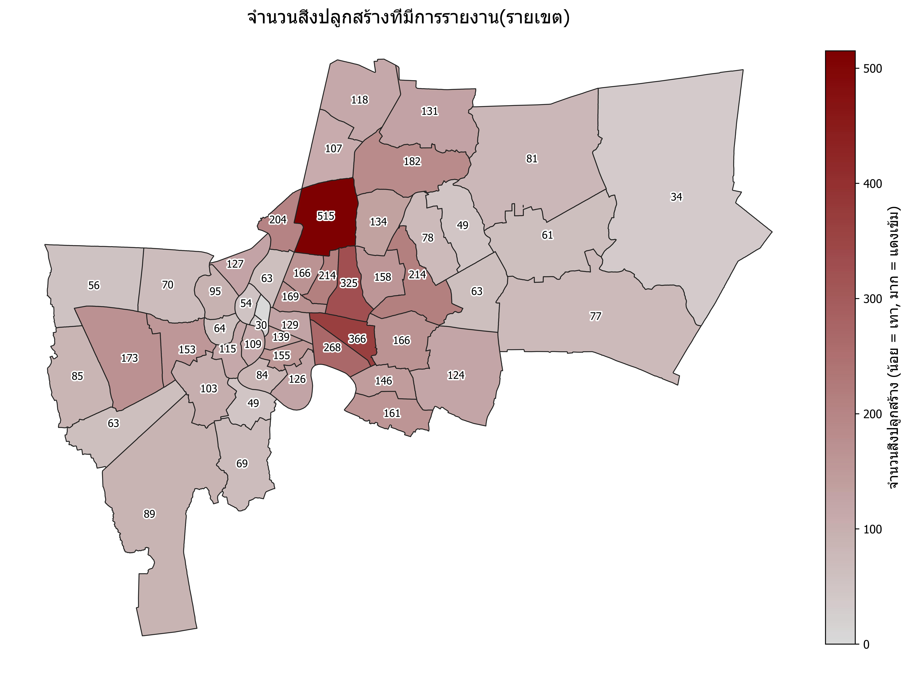

> 10แผนที่กรุงเทพมหานคร แสดงจำนวนสิ่งปลูกสร้างที่มีการแจ้งเหตุแผ่นดินไหวในแต่ละเขต ซึ่งสะท้อนให้เห็นถึงความหนาแน่นของการแจ้งเหตุในพื้นที่ต่างๆ โดยสีที่เข้มขึ้นจะแสดงถึงจำนวนการแจ้งเหตุที่สูงขึ้น
> 

จากการวิเคราะห์ข้อมูลด้วย Scatter Plot พบความสัมพันธ์เชิงบวกระหว่าง จำนวนการแจ้งเหตุ และ คะแนนความเสียหาย ของแต่ละเขตในกรุงเทพฯ กล่าวคือ เขตที่มีจำนวนการแจ้งเหตุมากก็มักจะมีระดับความเสียหายสูงตามไปด้วย


> 11กราฟแสดงความสัมพันธ์ระหว่าง จำนวนการแจ้งเหตุ (แกน X) และ คะแนนความเสียหาย (แกน Y) แยกตามแต่ละเขตของกรุงเทพมหานคร โดยเขตที่มีจำนวนการแจ้งเหตุสูง มักมีระดับความเสียหายสูงตามไปด้วย
> 

[https://github.com/tontantip/DADS5001-Project-Earthquake/blob/main/image/กราฟแสดงความสัมพันธ์ระหว่าง จำนวนการแจ้งเหตุ และ ความเสียหายที่ได้รับ ในแต่ละเขต.png](https://github.com/tontantip/DADS5001-Project-Earthquake/blob/main/image/%E0%B8%81%E0%B8%A3%E0%B8%B2%E0%B8%9F%E0%B9%81%E0%B8%AA%E0%B8%94%E0%B8%87%E0%B8%84%E0%B8%A7%E0%B8%B2%E0%B8%A1%E0%B8%AA%E0%B8%B1%E0%B8%A1%E0%B8%9E%E0%B8%B1%E0%B8%99%E0%B8%98%E0%B9%8C%E0%B8%A3%E0%B8%B0%E0%B8%AB%E0%B8%A7%E0%B9%88%E0%B8%B2%E0%B8%87%20%E0%B8%88%E0%B8%B3%E0%B8%99%E0%B8%A7%E0%B8%99%E0%B8%81%E0%B8%B2%E0%B8%A3%E0%B9%81%E0%B8%88%E0%B9%89%E0%B8%87%E0%B9%80%E0%B8%AB%E0%B8%95%E0%B8%B8%20%E0%B9%81%E0%B8%A5%E0%B8%B0%20%E0%B8%84%E0%B8%A7%E0%B8%B2%E0%B8%A1%E0%B9%80%E0%B8%AA%E0%B8%B5%E0%B8%A2%E0%B8%AB%E0%B8%B2%E0%B8%A2%E0%B8%97%E0%B8%B5%E0%B9%88%E0%B9%84%E0%B8%94%E0%B9%89%E0%B8%A3%E0%B8%B1%E0%B8%9A%20%E0%B9%83%E0%B8%99%E0%B9%81%E0%B8%95%E0%B9%88%E0%B8%A5%E0%B8%B0%E0%B9%80%E0%B8%82%E0%B8%95.png)

อย่างไรก็ตาม เมื่อพิจารณาความเสียหายของสิ่งปลูกสร้างในเชิงพื้นที่ต่อหน่วยตารางกิโลเมตร ผลการวิเคราะห์กลับไม่ได้เป็นไปในทิศทางเดียวกันทั้งหมด

จากกราฟแสดงผลการวิเคราะห์ พบว่า เขตบางรัก มีความหนาแน่นของสิ่งปลูกสร้างที่ได้รับความเสียหายต่อพื้นที่มากที่สุด รองลงมาคือ เขตวัฒนา และ เขตราชเทวี ตามลำดับ สะท้อนให้เห็นว่าพื้นที่บางเขตมีความเปราะบางต่อความเสียหายมากกว่าเขตอื่น แม้จำนวนการแจ้งเหตุจะไม่ได้สูงที่สุดก็ตาม

[https://github.com/tontantip/DADS5001-Project-Earthquake/blob/main/image/total_dmg_class_summary2.jpg](https://github.com/tontantip/DADS5001-Project-Earthquake/blob/main/image/total_dmg_class_summary2.jpg)


> 12กราฟแสดงข้อมูลความเสียหายของสิ่งปลูกสร้างในแต่ละเขต โดย **กราฟด้านซ้าย** แสดงจำนวนสิ่งปลูกสร้างที่ได้รับความเสียหาย ในขณะที่ **กราฟด้านขวา** แสดงความหนาแน่นของความเสียหายต่อพื้นที่ ซึ่งในทั้งสองกราฟ 5 อันดับแรกที่มีข้อมูลสูงสุดจะถูกเน้นเป็นสีแดง
> 

---


---

[https://github.com/tontantip/DADS5001-Project-Earthquake/blob/main/image/building_count_and_density_side_by_side(2).jpg](https://github.com/tontantip/DADS5001-Project-Earthquake/blob/main/image/building_count_and_density_side_by_side(2).jpg)

> 13แผนที่กรุงเทพมหานคร แสดงข้อมูลความเสียหายของสิ่งปลูกสร้างในแต่ละเขต โดย **กราฟด้านซ้าย** แสดงจำนวนสิ่งปลูกสร้างที่ได้รับความเสียหาย ในขณะที่ **กราฟด้านขวา** แสดงความหนาแน่นของความเสียหายต่อพื้นที่ โดยสีที่เข้มขึ้นจะแสดงถึงค่าที่มากขึ้น
> 

**ในการพิจารณาลักษณะของความเสียหาย** ได้มีการแบ่งระดับความรุนแรงตามองค์ประกอบหลักของสิ่งปลูกสร้าง ได้แก่ เสา พื้น ผนัง หลังคา และโครงสร้างรวม นำมาคำนวณเป็น **คะแนนรวมความเสียหาย (Damage Score)** และเปรียบเทียบกับ **เกณฑ์การตัดแบ่ง (Thresholds)** ซึ่งเป็นค่าตัวเลขเชิงสถิติที่กำหนดขึ้นเพื่อใช้เป็นจุดตัดระหว่างแต่ละระดับ เพื่อแปลงค่าคะแนนต่อเนื่องให้อยู่ในรูปแบบของ ระดับความเสียหายเชิงคุณภาพ 

ระดับความเสียหายถูกจำแนกออกเป็น 5 ระดับ ดังนี้

1. **ระดับวิกฤต**
2. **ระดับรุนแรง**
3. **ระดับปานกลาง**
4. **ระดับน้อย**
5. **ระดับน้อยมาก**

จากกราฟวงกลมพบว่า สิ่งปลูกสร้างส่วนใหญ่ได้รับความเสียหายใน ระดับน้อยมาก คิดเป็น 45.77% รองลงมาคือ ระดับน้อย 29.49% ขณะที่ความเสียหายในระดับ วิกฤตและรุนแรงรวมกันคิดเป็นเพียง 12.23% ของความเสียหายทั้งหมดในกรุงเทพมหานคร


> กราฟวงกลมแสดง สัดส่วนของความเสียหายตามประเภท ทั้ง 5 ระดับ
> 

[https://github.com/tontantip/DADS5001-Project-Earthquake/blob/main/image/กราฟวงกลมแสดงสัดส่วนของความเสียหายตามประเภท.png](https://github.com/tontantip/DADS5001-Project-Earthquake/blob/main/image/%E0%B8%81%E0%B8%A3%E0%B8%B2%E0%B8%9F%E0%B8%A7%E0%B8%87%E0%B8%81%E0%B8%A5%E0%B8%A1%E0%B9%81%E0%B8%AA%E0%B8%94%E0%B8%87%E0%B8%AA%E0%B8%B1%E0%B8%94%E0%B8%AA%E0%B9%88%E0%B8%A7%E0%B8%99%E0%B8%82%E0%B8%AD%E0%B8%87%E0%B8%84%E0%B8%A7%E0%B8%B2%E0%B8%A1%E0%B9%80%E0%B8%AA%E0%B8%B5%E0%B8%A2%E0%B8%AB%E0%B8%B2%E0%B8%A2%E0%B8%95%E0%B8%B2%E0%B8%A1%E0%B8%9B%E0%B8%A3%E0%B8%B0%E0%B9%80%E0%B8%A0%E0%B8%97.png)

แม้ว่าภาพรวมจะแสดงให้เห็นว่า ความเสียหายส่วนใหญ่เป็นระดับเล็กน้อยถึงปานกลาง แต่กลับพบข้อสังเกตที่น่าสนใจว่า สัดส่วนความเสียหายในระดับวิกฤตและรุนแรงไม่ได้สอดคล้องกับจำนวนสิ่งปลูกสร้างที่ได้รับความเสียหายทั้งหมดในแต่ละเขตเสมอไป กล่าวคือ เขตที่มีจำนวนสิ่งปลูกสร้างเสียหายมาก ไม่จำเป็นต้องเป็นเขตที่มีความเสียหายในระดับรุนแรงสูงสุด

ตัวอย่างที่ชัดเจนคือ เขตธนบุรี แม้จะไม่ได้มีจำนวนสิ่งปลูกสร้างที่เสียหายมากที่สุด แต่กลับมีสัดส่วนความเสียหายในระดับวิกฤตและรุนแรงสูงที่สุด คิดเป็น 30.00% ของความเสียหายในเขต ซึ่งสูงกว่าค่าเฉลี่ยของทั้งกรุงเทพมหานครที่อยู่เพียง 12.22% อย่างมีนัยสำคัญ รองลงมาคือ เขตห้วยขวาง เขตคลองสาน เขตภาษีเจริญ และเขตราชเทวี ตามลำดับ

ข้อค้นพบนี้ชี้ให้เห็นว่า การประเมินความเสี่ยงไม่สามารถพิจารณาเพียงจำนวนสิ่งปลูกสร้างที่เสียหายได้ แต่จำเป็นต้องดูไปถึงระดับความรุนแรงของผลกระทบด้วย เพราะเขตที่มีอาคารเสียหายไม่มาก อาจมีความเปราะบางในเชิงคุณภาพมากกว่าที่คิด


> แผนภาพแท่งแบบร้อยละแสดง สัดส่วนของความเสียหายตามประเภทในแต่ละเขต โดยแสดง 10 เขตแรกที่มีอาคารได้รับความเสียหายในระดับวิกฤตและรุนแรงมากที่สุด จากแผนภาพจะเห็นได้ว่า แม้บางเขตจะมีจำนวนอาคารได้รับความเสียหายสูง แต่สัดส่วนของระดับวิกฤตและรุนแรงอาจไม่สูงตามไปด้วย
> 

 [https://github.com/tontantip/DADS5001-Project-Earthquake/blob/main/image/สัดส่วนของความเสียหายตามประเภทในแต่ละเขต.png](https://github.com/tontantip/DADS5001-Project-Earthquake/blob/main/image/%E0%B8%AA%E0%B8%B1%E0%B8%94%E0%B8%AA%E0%B9%88%E0%B8%A7%E0%B8%99%E0%B8%82%E0%B8%AD%E0%B8%87%E0%B8%84%E0%B8%A7%E0%B8%B2%E0%B8%A1%E0%B9%80%E0%B8%AA%E0%B8%B5%E0%B8%A2%E0%B8%AB%E0%B8%B2%E0%B8%A2%E0%B8%95%E0%B8%B2%E0%B8%A1%E0%B8%9B%E0%B8%A3%E0%B8%B0%E0%B9%80%E0%B8%A0%E0%B8%97%E0%B9%83%E0%B8%99%E0%B9%81%E0%B8%95%E0%B9%88%E0%B8%A5%E0%B8%B0%E0%B9%80%E0%B8%82%E0%B8%95.png)

เมื่อขยายการวิเคราะห์จากจำนวนสิ่งปลูกสร้างที่ได้รับความเสียหาย ไปสู่การประเมินเชิงพื้นที่ โดยคำนวณพื้นที่ที่ได้รับผลกระทบจากรัศมีไม่เกิน 400 เมตรรอบสิ่งปลูกสร้างแต่ละแห่ง พบว่าพื้นที่เสียหายรวมมีค่าเฉลี่ยคิดเป็น 14.00% ของพื้นที่ทั้งหมดในกรุงเทพมหานคร ขณะที่หากพิจารณาเฉพาะความเสียหายในระดับวิกฤตและรุนแรง พื้นที่ที่ได้รับผลกระทบคิดเป็นค่าเฉลี่ย 5.04% ของพื้นที่ทั้งหมด

หากพิจารณาเป็นรายเขต พบว่า เขตบางรัก มีสัดส่วนความเสียหายสูงที่สุด คิดเป็น 59.64% ของพื้นที่ในเขต รองลงมาคือ เขตวัฒนา (52.09%) และ เขตคลองสาน (46.52%) ตามลำดับ แต่เมื่อโฟกัสเฉพาะความเสียหายในระดับวิกฤตและรุนแรง จะพบว่า เขตคลองสาน มีสัดส่วนสูงที่สุดถึง 34.57% ขณะที่เขตบางรักและเขตวัฒนาอยู่ใกล้เคียงกันที่ 21.42% และ 21.18% ตามลำดับ ข้อมูลนี้สะท้อนให้เห็นว่า ความรุนแรงของความเสียหายไม่ได้ขึ้นอยู่กับจำนวนสิ่งปลูกสร้างที่เสียหายเพียงอย่างเดียว แต่ยังขึ้นอยู่กับ ลักษณะพื้นที่ โครงสร้างอาคาร และความหนาแน่นของสิ่งปลูกสร้าง ที่แตกต่างกันในแต่ละเขตด้วย

นอกจากนี้ยังพบว่า มีทั้งหมด 14 เขต ที่มีค่าความเสียหายสูงกว่าค่าเฉลี่ยทั้งสองตัวแปร ได้แก่ เขตบางรัก เขตวัฒนา เขตคลองสาน เขตราชเทวี เขตคลองเตย เขตปทุมวัน เขตพญาไท เขตธนบุรี เขตดินแดง เขตห้วยขวาง เขตยานนาวา เขตสัมพันธวงศ์ เขตจตุจักร และเขตบางซื่อ โดยเขตเหล่านี้รวมกันคิดเป็น 77.87% ของความเสียหายในระดับรุนแรงและวิกฤตทั้งหมด แสดงให้เห็นว่าความเปราะบางไม่ได้กระจายอย่างสม่ำเสมอทั่วกรุงเทพมหานคร แต่กลับ กระจุกตัวอยู่ในบางพื้นที่เป็นหลัก

จากกราฟแผนที่จะเห็นการกระจายตัวของเขตที่ได้รับความเสียหายอย่างชัดเจน โดยเฉพาะ เขตใจกลางเมืองและพื้นที่ริมแม่น้ำเจ้าพระยา ซึ่งมีสัดส่วนความเสียหายสูงกว่าพื้นที่อื่น ๆ อย่างเด่นชัด 

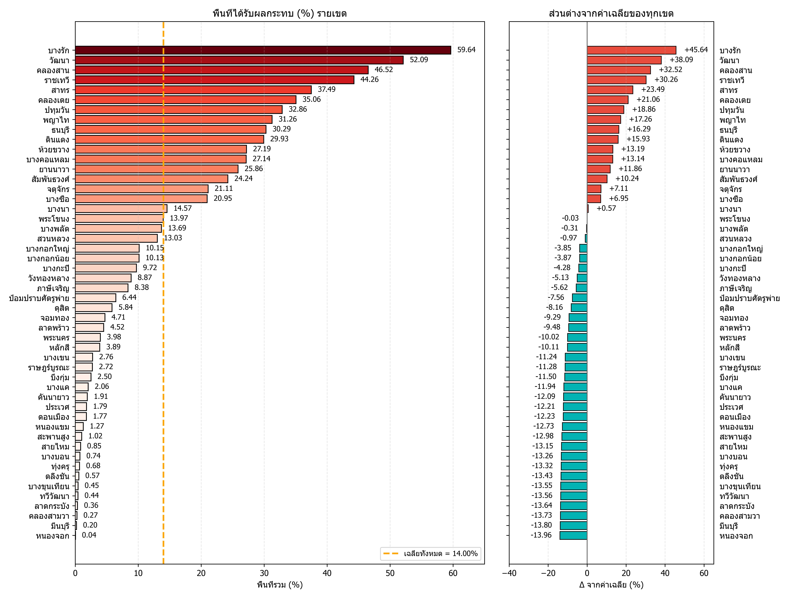

[https://github.com/tontantip/DADS5001-Project-Earthquake/blob/main/image/district_total_pct_dual_fixed.jpg](https://github.com/tontantip/DADS5001-Project-Earthquake/blob/main/image/district_total_pct_dual_fixed.jpg)

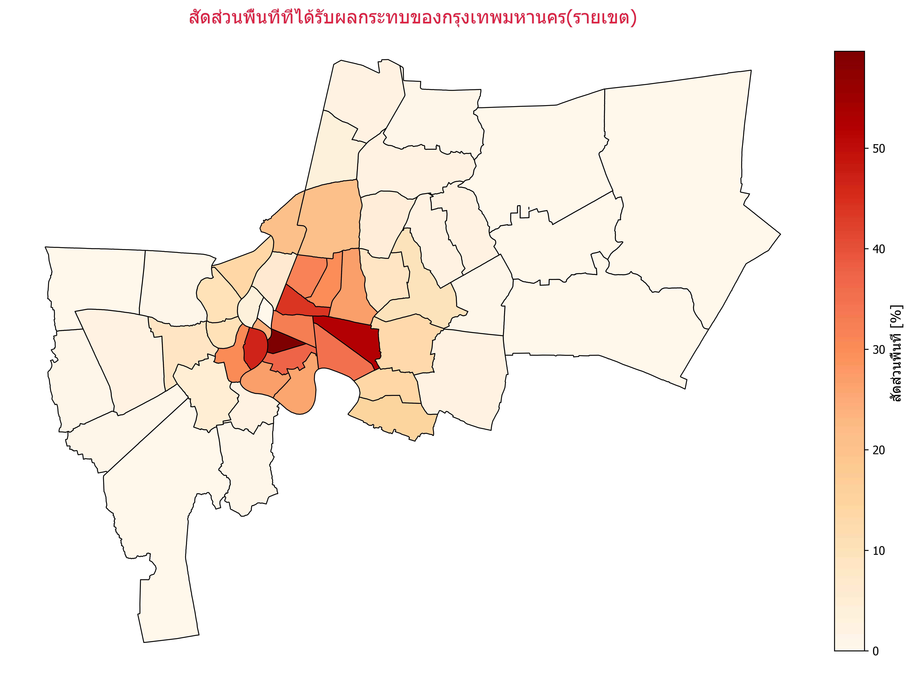

[https://github.com/tontantip/DADS5001-Project-Earthquake/blob/main/image/covered_pct_by_district.jpg](https://github.com/tontantip/DADS5001-Project-Earthquake/blob/main/image/covered_pct_by_district.jpg)

> 17แผนที่แสดงสัดส่วนพื้นที่ที่ได้รับผลกระทบจากความเสียหายในกรุงเทพมหานคร (รายเขต) โดยใช้ระดับสีเป็นตัวบ่งชี้ความรุนแรง เขตที่มีสีอ่อนหมายถึงพื้นที่เสียหายน้อย ขณะที่เขตที่มีสีแดงเข้มคือพื้นที่ที่ได้รับความเสียหายสูงสุด
> 

> 16การเปรียบเทียบสัดส่วนพื้นที่เสียหายตามเขตกับค่าเฉลี่ยรวม
กราฟด้านซ้ายแสดงสัดส่วนพื้นที่เสียหาย (%) ของแต่ละเขต โดยมีเส้นปะสีส้มแทนค่าเฉลี่ยรวมที่ 14% เขตที่มีบาร์ยาวเกินเส้นปะคือพื้นที่ที่ได้รับความเสียหายสูงกว่าค่าเฉลี่ย ในขณะที่เขตที่บาร์สั้นกว่าหมายถึงพื้นที่เสียหายน้อยกว่าโดยรวม ส่วนกราฟด้านขวาแสดงส่วนต่างจากค่าเฉลี่ยของสัดส่วนพื้นที่เสียหายในแต่ละเขต โดยค่าบวก (สีแดง) หมายถึงเขตที่เสียหายมากกว่าค่าเฉลี่ย และค่าลบ (สีเขียว) หมายถึงเขตที่เสียหายน้อยกว่าค่าเฉลี่ย ช่วยให้สามารถมองเห็นได้อย่างชัดเจนว่าพื้นที่ใดได้รับผลกระทบมากหรือน้อยเมื่อเปรียบเทียบกับค่าเฉลี่ยของกรุงเทพมหานครโดยรวม
> 

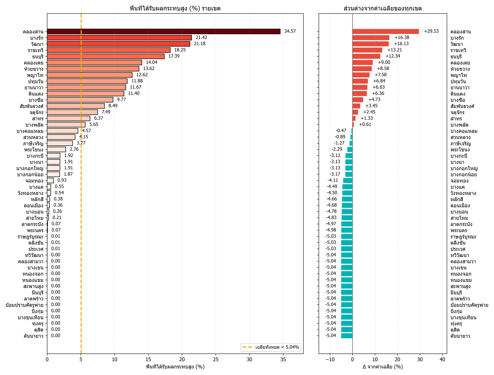

[https://github.com/tontantip/DADS5001-Project-Earthquake/blob/main/image/district_high_impact_dual.jpg](https://github.com/tontantip/DADS5001-Project-Earthquake/blob/main/image/district_high_impact_dual.jpg)

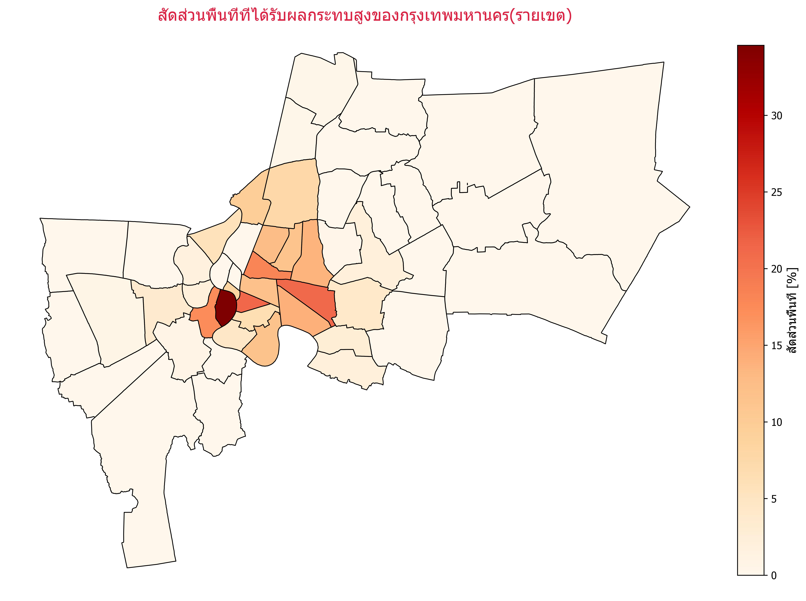

[https://github.com/tontantip/DADS5001-Project-Earthquake/blob/main/image/5_4_pct_by_district.jpg](https://github.com/tontantip/DADS5001-Project-Earthquake/blob/main/image/5_4_pct_by_district.jpg)

> 19แผนที่นี้แสดงสัดส่วนพื้นที่ที่ได้รับผลกระทบจากความเสียหายในระดับ **วิกฤตและรุนแรง** ของกรุงเทพมหานครในแต่ละเขต โดยใช้ระดับสีเป็นตัวบ่งชี้ความรุนแรงของผลกระทบ เขตที่ปรากฏเป็นสีอ่อนสะท้อนถึงพื้นที่ที่มีสัดส่วนความเสียหายต่ำ ในขณะที่เขตที่ปรากฏเป็นสีแดงเข้ม คือพื้นที่ที่มีสัดส่วนความเสียหายสูงสุด
> 

> 18การเปรียบเทียบสัดส่วนพื้นที่เสียหายในระดับ **วิกฤตและรุนแรง** ตามเขตกับค่าเฉลี่ยรวม
กราฟด้านซ้ายแสดงสัดส่วนพื้นที่เสียหาย (%) ของแต่ละเขต โดยมีเส้นปะสีส้มแทนค่าเฉลี่ยรวมที่ 14% เขตที่มีบาร์ยาวเกินเส้นปะคือพื้นที่ที่ได้รับความเสียหายสูงกว่าค่าเฉลี่ย ในขณะที่เขตที่บาร์สั้นกว่าหมายถึงพื้นที่เสียหายน้อยกว่าโดยรวม ส่วนกราฟด้านขวาแสดงส่วนต่างจากค่าเฉลี่ยของสัดส่วนพื้นที่เสียหายในแต่ละเขต โดยค่าบวก (สีแดง) หมายถึงเขตที่เสียหายมากกว่าค่าเฉลี่ย และค่าลบ (สีเขียว) หมายถึงเขตที่เสียหายน้อยกว่าค่าเฉลี่ย ช่วยให้สามารถมองเห็นได้อย่างชัดเจนว่าพื้นที่ใดได้รับผลกระทบมากหรือน้อยเมื่อเปรียบเทียบกับค่าเฉลี่ยของกรุงเทพมหานครโดยรวม
> 

เมื่อพิจารณาตามโซนผังเมือง พบว่าพื้นที่สีแดงเข้มซึ่งเป็นโซนพาณิชยกรรม มีความหนาแน่นของสิ่งปลูกสร้างสูงที่สุด คิดเป็น 18.8 แห่งต่อตารางกิโลเมตร ขณะที่พื้นที่สีแดง ซึ่งเป็นโซนที่อยู่อาศัยหนาแน่นมาก มีค่าใกล้เคียงกันอยู่ที่ 18.5 แห่งต่อตารางกิโลเมตร ความแตกต่างระหว่างสองกลุ่มนี้ถือว่าน้อยมาก แสดงให้เห็นว่าทั้งพื้นที่พาณิชยกรรมและที่อยู่อาศัยหนาแน่นล้วนมีความเสี่ยงสูงใกล้เคียงกัน

พื้นที่สีแดงเข้มกระจายตัวอยู่ตามแนวใจกลางเมืองและริมแม่น้ำเจ้าพระยา โดยเฉพาะ เขตบางรัก ปทุมวัน ธนบุรี และคลองสาน ซึ่งเป็นย่านศูนย์กลางเศรษฐกิจ พาณิชยกรรม และมีอาคารสูงจำนวนมาก ขณะที่พื้นที่สีแดง เช่น เขตห้วยขวาง ดินแดง และพญาไท เป็นย่านที่อยู่อาศัยหนาแน่น มีทั้งอาคารชุดและบ้านเรือนปะปนกัน ส่งผลให้โครงสร้างพื้นฐานและประชากรในพื้นที่เหล่านี้มีความเสี่ยงต่อความเสียหายสูงไม่ต่างกัน

ถัดมาเป็นพื้นที่สีส้มเข้ม ซึ่งเป็นโซนอนุรักษ์วัฒนธรรมไทย ความหนาแน่นอยู่ที่ประมาณ 9 แห่งต่อตารางกิโลเมตร อาคารในพื้นที่นี้ส่วนใหญ่เป็นอาคารเก่า มีคุณค่าทางประวัติศาสตร์และวัฒนธรรม เช่น ในบริเวณเกาะรัตนโกสินทร์และเขตพระนคร จึงมีความเปราะบางสูงหากเกิดเหตุการณ์แผ่นดินไหว เนื่องจากโครงสร้างอาคารไม่ได้ถูกออกแบบให้รองรับแรงสั่นสะเทือน

จาก แผนที่ A ที่แสดงความหนาแน่นของสิ่งปลูกสร้างที่ได้รับความเสียหายตามโซนผังเมือง สามารถสังเกตได้ว่ารูปแบบการกระจายตัวมีความสอดคล้องกับ แผนที่ B ที่แสดงสัดส่วนพื้นที่ที่ได้รับผลกระทบรายเขต โดยเฉพาะอย่างยิ่งใน 14 เขตเสี่ยงสูง ที่พบว่ามีสัดส่วนความเสียหายเกินค่าเฉลี่ย ซึ่งส่วนใหญ่อยู่ในใจกลางเมืองและพื้นที่ริมแม่น้ำเจ้าพระยา การซ้อนทับของผลการวิเคราะห์จากทั้งสองแผนที่ยิ่งยืนยันว่า เขตเหล่านี้คือพื้นที่ที่ควรจัดลำดับความสำคัญสูงสุดในการเตรียมความพร้อมและกำหนดมาตรการรองรับภัยพิบัติ #AและB แทน ตัวเลขรูปภาพ  


[https://github.com/tontantip/DADS5001-Project-Earthquake/blob/main/image/zone_group_density.jpg](https://github.com/tontantip/DADS5001-Project-Earthquake/blob/main/image/zone_group_density.jpg)

> 20แผนที่กรุงเทพ แสดงความหนาแน่นของสิ่งปลูกสร้างที่ได้รับความเสียหายตามโซนผังเมือง
> 

จากผลการวิเคราะห์ที่ผ่านมาจะเห็นภาพความเสียหายของสิ่งปลูกสร้างในหลายมิติ อย่างไรก็ตาม หากนำข้อมูลดังกล่าวมาเชื่อมโยงกับความหนาแน่นของประชากรในแต่ละเขต ทำให้สามารถระบุเขตที่มีความเสี่ยงสูงต่อผลกระทบจากแผ่นดินไหวได้ชัดเจนยิ่งขึ้น เขตที่มีทั้งจำนวนประชากรหนาแน่นและระดับความเสียหายของสิ่งปลูกสร้างสูง เช่น เขตธนบุรี และเขตคลองสาน ย่อมมีความเสี่ยงที่จะได้รับผลกระทบในวงกว้าง ขณะเดียวกัน เขตที่มีสัดส่วนความเสียหายรุนแรงแม้ประชากรจะไม่หนาแน่นนัก เช่น เขตห้วยขวาง และเขตวัฒนา ก็ยังถือว่าเป็นพื้นที่ที่ต้องให้ความสำคัญในการเตรียมการรับมือเช่นกัน

เมื่อพิจารณาจากกราฟ Bubble Chart  เขตที่ทั้งอยู่Quadrant ด้านขวาบน ที่อยู่เหนือเส้นค่าเฉลี่ยความเสียหายและมีประชากรหนาแน่นกว่ามากกว่าค่าเฉลี่ยถือว่ามี ความเสี่ยงสูงที่สุด เพราะทั้งมีจำนวนประชากรหนาแน่นและระดับความเสียหายของสิ่งปลูกสร้างสูง (เช่น เขตธนบุรี เขตคลองสาน และเขตบางรัก) ย่อมมีความเสี่ยงที่จะได้รับผลกระทบในวงกว้าง หากเกิดแผ่นดินไหว

ขณะเดียวกันเขตที่อยู่Quadrantซ้ายบน เขตที่มีสัดส่วนความเสียหายรุนแรงแม้ประชากรจะไม่หนาแน่นนัก  (เช่น เขตห้วยขวา วัฒนา จตุจักร) ก็ยังคงต้องให้ความสำคัญ ก็ยังถือว่าเป็นพื้นที่ที่ต้องให้ความสำคัญในการเตรียมการรับมือเช่นกัน

---

---

---


> Bubble Chart แสดงค่าเฉลี่ยของคะแนนความเสียหายรวม(score) บนแกนตั้ง กับ พื้นที่ต่อประชากร (คนต่อตารางกิโลเมตร) บนแกนนอน โดยขนาดของฟองแสดงถึง ผลรวมคะแนนความเสียหายรวมของแต่ละเขต เส้นปะแนวนอนแสดงถึงค่าเฉลี่ยของ **ค่าเฉลี่ยความเสียหาย**  ส่วนเส้นปะแนวตั้งแสดงถึงค่าเฉลี่ยของ **จำนวนประชากรตามพื้นที่**
> 

[https://github.com/tontantip/DADS5001-Project-Earthquake/blob/main/image/แผนภูมิฟองแสดงความสัมพันธ์ระหว่างคะแนนความเสียหายเฉลี่ยและความหนาแน่นประชากรตามเขต.png](https://github.com/tontantip/DADS5001-Project-Earthquake/blob/main/image/%E0%B9%81%E0%B8%9C%E0%B8%99%E0%B8%A0%E0%B8%B9%E0%B8%A1%E0%B8%B4%E0%B8%9F%E0%B8%AD%E0%B8%87%E0%B9%81%E0%B8%AA%E0%B8%94%E0%B8%87%E0%B8%84%E0%B8%A7%E0%B8%B2%E0%B8%A1%E0%B8%AA%E0%B8%B1%E0%B8%A1%E0%B8%9E%E0%B8%B1%E0%B8%99%E0%B8%98%E0%B9%8C%E0%B8%A3%E0%B8%B0%E0%B8%AB%E0%B8%A7%E0%B9%88%E0%B8%B2%E0%B8%87%E0%B8%84%E0%B8%B0%E0%B9%81%E0%B8%99%E0%B8%99%E0%B8%84%E0%B8%A7%E0%B8%B2%E0%B8%A1%E0%B9%80%E0%B8%AA%E0%B8%B5%E0%B8%A2%E0%B8%AB%E0%B8%B2%E0%B8%A2%E0%B9%80%E0%B8%89%E0%B8%A5%E0%B8%B5%E0%B9%88%E0%B8%A2%E0%B9%81%E0%B8%A5%E0%B8%B0%E0%B8%84%E0%B8%A7%E0%B8%B2%E0%B8%A1%E0%B8%AB%E0%B8%99%E0%B8%B2%E0%B9%81%E0%B8%99%E0%B9%88%E0%B8%99%E0%B8%9B%E0%B8%A3%E0%B8%B0%E0%B8%8A%E0%B8%B2%E0%B8%81%E0%B8%A3%E0%B8%95%E0%B8%B2%E0%B8%A1%E0%B9%80%E0%B8%82%E0%B8%95.png)

เมื่อพิจารณาเพิ่มเติมในมิติของประชากร ได้แบ่งออกเป็น 2 กลุ่มหลัก คือ

กลุ่มเปราะบาง ได้แก่ เด็กและผู้สูงอายุ ซึ่งช่วยเหลือตัวเองได้จำกัด

กลุ่มที่สามารถช่วยเหลือตนเองได้ ได้แก่ วัยรุ่นและวัยทำงาน

ค่าเฉลี่ยของสัดส่วนประชากรกลุ่มเปราะบางในกรุงเทพมหานครอยู่ที่ 33.52%


> กราฟแสดงเขตที่มีกลุ่มเปราะบางสูงกว่าค่าเฉลี่ย
> 

[https://github.com/tontantip/DADS5001-Project-Earthquake/blob/main/image/สัดส่วนกลุ่มเปราะบาง.png](https://github.com/tontantip/DADS5001-Project-Earthquake/blob/main/image/%E0%B8%AA%E0%B8%B1%E0%B8%94%E0%B8%AA%E0%B9%88%E0%B8%A7%E0%B8%99%E0%B8%81%E0%B8%A5%E0%B8%B8%E0%B9%88%E0%B8%A1%E0%B9%80%E0%B8%9B%E0%B8%A3%E0%B8%B2%E0%B8%B0%E0%B8%9A%E0%B8%B2%E0%B8%87.png)

เมื่อนำ Bubble Chart มาพิจารณาร่วมกับ 14 เขตที่มีพื้นที่เสียหายสูงกว่าค่าเฉลี่ยและมีกลุ่มเปราะบางมาก พบว่าสามารถจัดกลุ่มเขตตามลักษณะความเสี่ยงได้อย่างชัดเจนยิ่งขึ้น

- **Quadrant ด้านขวาบน** ได้แก่ เขตธนบุรี คลองสาน บางรัก ราชเทวี บางซื่อ และดินแดง ถือเป็นพื้นที่ที่มีความเสี่ยงสูงสุด เนื่องจากไม่เพียงแต่มีค่าเฉลี่ยความเสียหายและความหนาแน่นประชากรสูงเท่านั้น แต่ยังมีกลุ่มเปราะบางมากกว่าค่าเฉลี่ยอีกด้วย ส่งผลให้พื้นที่เหล่านี้เป็นจุดที่ต้องให้ความสำคัญเป็นอันดับแรกในการวางแผนรับมือ
- **Quadrant ด้านซ้ายบน** ได้แก่ เขตวัฒนา ยานนาวา และปทุมวัน แม้ประชากรจะไม่หนาแน่นเท่ากับพื้นที่อื่น แต่กลับมีสัดส่วนความเสียหายสูงและกลุ่มเปราะบางมากกว่าค่าเฉลี่ยเช่นกัน จึงยังถือว่าเป็นเขตที่มีความเสี่ยงและต้องได้รับการจัดการอย่างรอบคอบ


> Bubble Chart แสดงค่าเฉลี่ยของคะแนนความเสียหายรวม(score) บนแกนตั้ง กับ พื้นที่ต่อประชากร (คนต่อตารางกิโลเมตร) บนแกนนอน โดยขนาดของฟองแสดงถึง ผลรวมคะแนนความเสียหายรวมของแต่ละเขต เส้นปะแนวนอนแสดงถึงค่าเฉลี่ยของ ค่าเฉลี่ยความเสียหาย  ส่วนเส้นปะแนวตั้งแสดงถึงค่าเฉลี่ยของ จำนวนประชากรตามพื้นที่ **แสดงเฉพาะ เขตที่มีทั้งความเสียหายและสัดส่วนประชากรกลุ่มเปราะบางสูงกว่าค่าเฉลี่ย**
> 

[https://github.com/tontantip/DADS5001-Project-Earthquake/blob/main/image/Bubble Chart final.png](https://github.com/tontantip/DADS5001-Project-Earthquake/blob/main/image/Bubble%20Chart%20final.png)

จากการวิเคราะห์ในหลายมิติ ทั้งด้านความเสียหายของสิ่งปลูกสร้าง ระดับความรุนแรง พื้นที่ที่ได้รับผลกระทบ ลักษณะการใช้ประโยชน์ที่ดินตามผังเมือง ตลอดจนจำนวนประชากรและสัดส่วนของกลุ่มเปราะบาง ทำให้เห็นได้อย่างชัดเจนว่า ความเสี่ยงจากแผ่นดินไหวในกรุงเทพมหานครไม่ได้กระจายอย่างเท่าเทียม แต่กลับกระจุกตัวอยู่ในบางพื้นที่ โดยเฉพาะเขตใจกลางเมืองและพื้นที่ริมแม่น้ำเจ้าพระยา ซึ่งมีทั้งความหนาแน่นของสิ่งปลูกสร้างและประชากรสูง

ผลการวิเคราะห์นี้ชี้ให้เห็นถึงความจำเป็นที่ต้องใช้ข้อมูลเชิงบูรณาการในการจัดลำดับความสำคัญของการวางแผนรับมือภัยพิบัติ ไม่ว่าจะเป็นการเสริมความแข็งแรงของโครงสร้างพื้นฐาน การจัดสรรทรัพยากรเพื่อรองรับสถานการณ์ฉุกเฉิน หรือการกำหนดมาตรการช่วยเหลือกลุ่มประชากรเฉพาะพื้นที่

ประเด็นสำคัญจากการจัดกลุ่มเขตตามลักษณะความเสี่ยง คือ ความเปราะบางไม่ได้เกิดจากปัจจัยใดปัจจัยหนึ่ง แต่เป็นผลผสมผสานของหลายด้าน ไม่ว่าจะเป็น ปริมาณความเสียหายเชิงโครงสร้าง ความหนาแน่นของประชากร และสัดส่วนกลุ่มเปราะบาง ดังนั้น เขตที่มีค่าตัวชี้วัดสูงกว่าค่าเฉลี่ยในทุกมิติ ต้องถูกจัดเป็น พื้นที่เสี่ยงสูงสุด ที่ควรได้รับมาตรการเชิงรุกทั้งด้านการป้องกันและการเตรียมความพร้อม ขณะที่เขตที่มีความเสี่ยงต่ำกว่า แม้จะไม่ใช่จุดวิกฤต แต่ก็ยังต้องได้รับการเฝ้าระวังและวางแผนจัดการอย่างเหมาะสมตามลักษณะเฉพาะของพื้นที่นั้น ๆ

---

# 3.พื้นที่ปลอดภัยในแต่ละเขต

แผนที่แสดงสัดส่วนของพื้นที่ที่ ไม่ได้รับผลกระทบ จากความเสียหายในแต่ละเขต จากผลการสังเกตพบว่า เขตที่มีพื้นที่ปลอดภัยมาก มักเป็นเขตรอบนอกของกรุงเทพมหานคร ซึ่งมีความหนาแน่นของสิ่งปลูกสร้างต่ำ ทำให้ความเสียหายไม่กระจุกตัว ตรงกันข้าม เขตใจกลางเมืองและพื้นที่ริมแม่น้ำเจ้าพระยา ซึ่งมีทั้งอาคารเก่าและอาคารสูงหนาแน่น มักมีสีอ่อน แสดงว่าพื้นที่ที่ปลอดภัยมีสัดส่วนน้อยกว่าชัดเจน

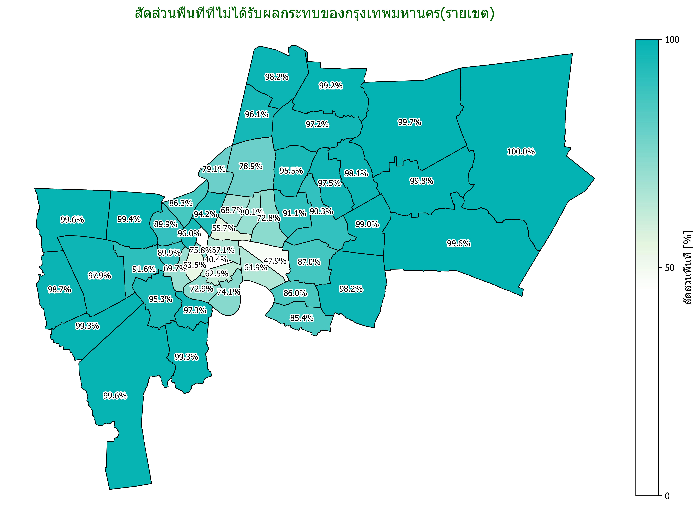

[https://github.com/tontantip/DADS5001-Project-Earthquake/blob/main/image/uncovered_pct_by_district.jpg](https://github.com/tontantip/DADS5001-Project-Earthquake/blob/main/image/uncovered_pct_by_district.jpg)

> แผนที่แสดงสัดส่วนของพื้นที่ที่ **ไม่ได้รับผลกระทบ**จากความเสียหายในแต่ละเขต โดยใช้ระดับสีเป็นตัวบ่งชี้ เขตที่มีสีเข้มหมายถึง ไม่ได้รับผลกระทบเลย หรือมีพื้นที่ที่ปลอดภัยจากความเสียหายมากที่สุด ขณะที่สีอ่อนสะท้อนถึงเขตที่ยังคงมีพื้นที่จำนวนหนึ่งได้รับผลกระทบ
> 

เมื่อนำพื้นที่ที่ไม่ได้รับผลกระทบจากเหตุการณ์แผ่นดินไหวมาพิจารณาโดยนำมาหาสัดส่วนต่อจำนวนประชากรของแต่ละเขต เพื่อพิจารณาว่าหาเกิดเหตุทำให้พื้นที่ได้รับความเสียหายจำเป็นต้องอพยพพื้นที่ที่ปลอดภัยหรือพื้นที่ที่ไม่ได้รับผลกระทบมีเพียงพอหรือไม่ อ้างอิงจากแนวทางการปฏิบัติของ สำนักงานข้าหลวงใหญ่ผู้ลี้ภัยแห่งสหประชาชาติ (UNHCR) ได้กำหนดว่าแนวทางปฏิบัติในสถานการณ์ด้านมนุษยธรรม พื้นที่พักพิงชั่วคราวสำหรับผู้ประสบภัยอยู่ที่ 30 ตารางเมตรต่อคนจำนวนนี้รวมพื้นที่ครอบคลุมถึงพื้นที่ส่วนกลางและบริการอื่นๆ จาก Figure พบว่าเขตบางรักมีพื้นที่ที่ไม่ได้รับผลกระทบเหลือต่อคนน้อยที่สุดอยู่ที่ 47.9 ตารางเมตรต่อคน ซึ่งจำนวนนี้ก็มากกว่าที่ UNHCR กำหนดไว้ จากข้อมูลทำให้ได้ข้อสรุปว่าแม้ในพื้นที่เขตบางรักที่มีพื้นที่ต่อคนน้อยที่สุด ยังคงเพียงพอตามมาตรฐานของ UNHCR แสดงให้เห็นว่าถ้าพิจารณาในเชิงพื้นที่กรุงเทพมหานครมีพื้นที่เพียงพอรองรับการอพยพ อย่างไรก็ตามควรพิจารณาเพิ่มเติมได้แก่ คุณภาพของของพื้นที่ปลอดภัย (น้ำ, อาหาร, การได้รับการรักษาพยาบาล) เพื่อให้การจัดการในสถานการณ์อย่างมีประสิทธิภาพ และส่วนสำคัญที่ควรพิจารณาต่อไปคือ พิจารณากลุ่มเปราะบาง เช่น วัยทารก, วัยเด็ก, และวัยผู้สูงอายุ ของแต่ละเขตพื้นที่

#พี่เอาของนิวมาเขียนเพิ่มต่อ ถ้าโอเคก็เอาไปใส่ได้ แต่ถ้าไม่โอก็ใช้ของนิวด้านบนได้เลย

เมื่อนำพื้นที่ที่ไม่ได้รับผลกระทบจากเหตุการณ์แผ่นดินไหวมาพิจารณาในเชิงสัดส่วนต่อจำนวนประชากรของแต่ละเขต จะช่วยให้มองเห็นได้ว่า หากเกิดสถานการณ์จริง พื้นที่ปลอดภัยหรือพื้นที่ที่ไม่ได้รับผลกระทบมีเพียงพอต่อการรองรับการอพยพหรือไม่ โดยอ้างอิงตามแนวทางของ สำนักงานข้าหลวงใหญ่ผู้ลี้ภัยแห่งสหประชาชาติ (UNHCR) ที่กำหนดมาตรฐานพื้นที่พักพิงชั่วคราวไว้ที่ 30 ตารางเมตรต่อคน (รวมถึงพื้นที่ส่วนกลางและบริการต่าง ๆ)

จากผลการวิเคราะห์ พบว่า เขตบางรัก ซึ่งเป็นเขตที่มีพื้นที่ปลอดภัยต่อคนน้อยที่สุด ยังมีค่าเฉลี่ยอยู่ที่ 47.9 ตารางเมตรต่อคน ซึ่งมากกว่ามาตรฐานที่ UNHCR กำหนดไว้ สรุปได้ว่า หากพิจารณาในภาพรวมของกรุงเทพมหานครแล้ว พื้นที่ปลอดภัยยังคงมีความเพียงพอสำหรับการรองรับการอพยพของประชาชน 

อย่างไรก็ตามการพิจารณาเฉพาะด้านพื้นที่เพียงอย่างเดียวอาจไม่เพียงพอ ปัจจัยสำคัญที่ต้องคำนึงถึงเพิ่มเติม ได้แก่ คุณภาพของพื้นที่ปลอดภัย เช่น การเข้าถึงน้ำดื่ม อาหาร การรักษาพยาบาล และระบบสาธารณูปโภคที่จำเป็น รวมถึง ความเหมาะสมสำหรับกลุ่มเปราะบาง อย่างวัยทารก เด็ก และผู้สูงอายุ ที่ต้องการการดูแลและการสนับสนุนเฉพาะด้าน

ดังนั้น การใช้พื้นที่ที่ไม่ได้รับผลกระทบควรถูกกำหนดให้เป็นโซนปลอดภัยหรือศูนย์พักพิงเมื่อเกิดเหตุแผ่นดินไหว พร้อมเชื่อมโยงเครือข่ายพื้นที่ปลอดภัยเข้ากับเขตเสี่ยงสูง เช่น บางรัก คลองสาน และธนบุรี เพื่อรองรับการอพยพได้อย่างรวดเร็ว นอกจากนี้ เขตที่มีพื้นที่ปลอดภัยมากควรได้รับการจัดสรรทรัพยากรฉุกเฉินล่วงหน้า เช่น เต็นท์ เครื่องมือแพทย์ และอาหาร เพื่อรองรับผู้ประสบภัยจากเขตที่ได้รับผลกระทบรุนแรง

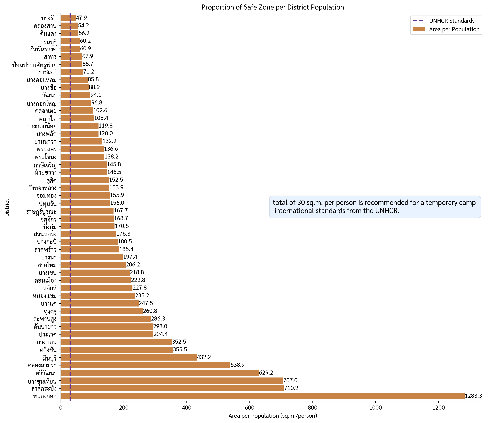

Figure : กราฟแสดงสัดส่วนพื้นที่ที่ไม่ได้รับผลกระทบต่อจำนวนประชากรในพื้นที่แบ่งตามเขต(ตารางเมตรต่อคน) Proportion of Safe Zone District Population แกน X พื้นที่ที่ไม่ได้รับผลกระทบต่อจำนวนประชากร แกน Y เขตในกรุงเทพมหานคร

# 4. เสี่ยงสูง(จากเขตเสี่ยง) กลาง  ต่ำ

Zone ที่มีกลุ่มเปราะบางมาก: ให้มีการจัดกลุ่มบริการทางการแพทย์ให้มีจำนวนที่ครอบคลุม เพื่อให้ง่ายต่อการเข้าถึง และจัดพื้นที่เพื่อเปลี่ยนผ้าอ้อมและให้นมบุตรโดยเฉพาะ

Zone ที่มีจำนวนครอบครัวและเด็กเล็กมาก: จัดพื้นท่ให้มีการทำกิจกรรมรวมกันร่วมไปถึงการดูแลเด็กเล็กด้วย

Zone กลุ่มที่สามารถช่วยเหลือตนเองได้มาก: กลุ่มนี้สามารถให้ช่วยและมีส่วนร่วมในการจัดการได้โดยการให้ข้อมูลที่จำเป็น

 และทรัพยากรและการบริการพื้นฐานก็ควรที่จะมีอย่างเหมาะและเพียงพอ เช่น อาหารและน้ำ ยารักษาโรค การให้บริการทางการแพทย์และสุขอนามัย และที่สำคัญการสื่อสารข้อมูลที่เป็นข้อเท็จจริงเพื่อหลีกการตื่นตระหนก

[Map_viz.html](Map_viz.html)

##